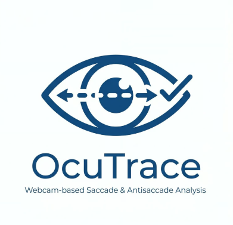

<p align="center">
  
</p>

<h1 align="center">OcuTrace</h1>

<p align="center">
  Webcam-based saccade & antisaccade analysis for neurological screening
</p>

<p align="center">
  <a href="#installation">Installation</a> •
  <a href="#quick-start">Quick Start</a> •
  <a href="#gui-launcher">GUI Launcher</a> •
  <a href="#how-it-works">How It Works</a> •
  <a href="#configuration">Configuration</a>
</p>

---

OcuTrace is a webcam-based saccade and antisaccade analysis system for neurological screening, focused on Parkinson's Disease monitoring. It provides an affordable alternative to commercial eye-tracking devices (Tobii, EyeLink) using standard webcams and implements the gap antisaccade paradigm — a well-established clinical protocol for detecting oculomotor dysfunction.

## What It Does

OcuTrace uses your laptop's webcam to track iris movements in real time and measure how quickly and accurately a person can control their eye movements. The system runs a standardized test consisting of 60 trials:

- **Antisaccade trials (40):** A dot appears on one side of the screen. The patient must look at the **opposite** side. This requires inhibitory control — the ability to suppress an automatic eye movement toward the stimulus.
- **Prosaccade trials (20):** A dot appears on one side. The patient looks **toward** it. This measures basic saccade speed.

A colored fixation dot at the center tells the patient what to do:
- **Red dot** → look **opposite** to the target (antisaccade)
- **Green dot** → look **toward** the target (prosaccade)

## What It Measures

| Metric | What It Means | Normal Range |
|--------|---------------|--------------|
| **Antisaccade error rate** | % of trials where the patient looked toward the stimulus instead of away | < 20% in healthy adults |
| **Saccade latency** | Time from stimulus onset to first eye movement (ms) | 150–400 ms |
| **Antisaccade latency** | Typically longer than prosaccade latency | 200–400 ms |
| **Prosaccade latency** | Baseline saccade reaction time | 150–250 ms |

Elevated antisaccade error rates and increased latencies are associated with frontal lobe dysfunction, which is common in Parkinson's Disease and other neurodegenerative conditions.

## Installation

### Requirements
- **Python 3.10** (PsychoPy is not compatible with 3.12+)
- **Webcam** (built-in laptop camera works)
- **Windows 10/11** or **macOS** (Linux support planned)

### Windows Setup

```powershell
# 1. Download and extract the zip, or clone the repo
git clone https://github.com/barisozyurt/OcuTrace.git
cd OcuTrace

# 2. Create virtual environment with Python 3.10
python -m venv .venv

# 3. Activate virtual environment
.\.venv\Scripts\Activate.ps1
# If you get an execution policy error, run this first:
# Set-ExecutionPolicy -ExecutionPolicy RemoteSigned -Scope CurrentUser

# 4. Install dependencies (may take 5-10 minutes)
pip install --upgrade pip setuptools wheel
pip install -r requirements.txt

# 5. Download MediaPipe face landmarker model (one-time, ~4 MB)
mkdir models
curl -L -o models/face_landmarker.task "https://storage.googleapis.com/mediapipe-models/face_landmarker/face_landmarker/float16/1/face_landmarker.task"

# 6. Launch OcuTrace
python main.py
```

### macOS Setup

```bash
# 1. Install Python 3.10 via Homebrew
brew install python@3.10

# 2. Clone the repo
git clone https://github.com/barisozyurt/OcuTrace.git
cd OcuTrace

# 3. Create and activate virtual environment
python3.10 -m venv .venv
source .venv/bin/activate

# 4. Install dependencies
pip install --upgrade pip setuptools wheel
pip install -r requirements.txt

# 5. Download MediaPipe model
mkdir -p models
curl -L -o models/face_landmarker.task "https://storage.googleapis.com/mediapipe-models/face_landmarker/face_landmarker/float16/1/face_landmarker.task"

# 6. Launch OcuTrace
python main.py
```

> **macOS notes:** Grant camera access to Terminal/Python when prompted (System Settings → Privacy & Security → Camera). PsychoPy fullscreen may require accessibility permissions on macOS Sonoma+.

## Quick Start

### Option 1: GUI Launcher

The simplest way to run OcuTrace:

```bash
python main.py
```

This opens a GUI window where you can:
1. Enter the patient name
2. Click **Calibrate** to run 9-point calibration
3. Click **Run Test** to run the 60-trial experiment
4. Click **Show Report** to generate and view the clinical report

Or use **Calibrate + Test** to do both in one step.

### Option 2: Command Line

```bash
# Calibrate + run test in one step
python scripts/run_session.py --participant "Patient Name" --calibrate

# Run test only (uses existing calibration)
python scripts/run_session.py --participant "Patient Name"

# Enable debug logging for saccade detection diagnostics
python scripts/run_session.py --participant "Patient Name" --debug
```

## During the Test

### Calibration (9 dots)
Look directly at each white dot as it appears on screen. Hold your gaze steady. A countdown shows how many dots remain.

### Experiment (60 trials)
Each trial shows a fixation dot at the center, then a target dot appears on the left or right:

- **Red fixation dot** → Antisaccade: look at the **opposite** side from the target
- **Green fixation dot** → Prosaccade: look **toward** the target

A trial counter at the top of the screen shows progress (e.g., "15/60").

Press **ESC** at any time to abort the session (partial results are saved).

## Reports & Dashboard

### Generate Reports

```bash
# Analyze the most recent session
python scripts/analyze.py --latest

# Analyze a specific session
python scripts/analyze.py --session SESSION_ID

# List all sessions
python scripts/analyze.py --list
```

Reports are saved as PNG files in `~/Documents/OcuTrace/reports/`.

### Web Dashboard

```bash
python scripts/dashboard.py
# Open http://127.0.0.1:5000 in browser
```

The dashboard shows all sessions with summary metrics, latency plots, error rate charts, and trial-by-trial details.

## How It Works

### Pipeline

```
Webcam (30fps) → MediaPipe Iris Tracking → Calibration (pixel → degree)
    → PsychoPy Stimulus Presentation (flip-based timing)
    → Saccade Detection (velocity-threshold algorithm)
    → Clinical Metrics → Report / Dashboard
```

### Technical Details

1. **Iris Tracking:** MediaPipe FaceLandmarker detects iris centers (landmarks 468/473) at ~30fps from a standard 640x480 webcam.

2. **Calibration:** 9-point calibration maps pixel coordinates to degrees of visual angle using independent X/Y affine transforms with webcam parallax compensation.

3. **Stimulus Presentation:** PsychoPy presents the gap antisaccade paradigm with frame-accurate flip-based timing:
   - Fixation (1000ms) → Gap/blank (200ms) → Peripheral stimulus at ±10° (1500ms) → ITI (1000–1500ms random)
   - Timing jitter < 2ms verified via built-in validation script.

4. **Saccade Detection:** Dual-strategy approach optimized for webcam data:
   - *Primary:* Velocity-threshold — Savitzky-Golay smoothing (window=3, poly=2), onset at 15 deg/s, offset at 8 deg/s, minimum 2° amplitude.
   - *Fallback:* Displacement-based — if velocity detection fails, measures position shift from pre-stimulus baseline. Catches saccades that smoothing attenuates below velocity threshold.
   - Reports warn when detection rate is below 50%.

5. **Glasses Detection:** Automatic quality gate measures iris tracking stability. If glasses degrade tracking quality, the system warns the user before proceeding.

6. **Data Storage:** SQLite database stores sessions, trials, raw gaze data, and calibration results. All raw iris coordinates are preserved alongside computed metrics.

## Project Structure

```
OcuTrace/
├── config/
│   └── settings.yaml              # All configurable parameters
├── src/
│   ├── paths.py                   # Centralized path resolution
│   ├── orchestrator.py            # High-level workflow functions
│   ├── tracking/
│   │   ├── iris_tracker.py        # MediaPipe iris coordinate extraction
│   │   ├── calibration.py         # Pixel-to-degree affine transform
│   │   ├── calibration_display.py # Calibration target generation
│   │   └── glasses_detector.py    # Glasses detection + quality gate
│   ├── experiment/
│   │   ├── paradigm.py            # Trial sequence generation
│   │   ├── stimulus.py            # PsychoPy stimulus components
│   │   └── session.py             # Gaze collection + trial analysis
│   ├── analysis/
│   │   ├── signal_processing.py   # Savitzky-Golay smoothing + velocity
│   │   ├── saccade_detector.py    # Velocity-threshold onset detection
│   │   └── metrics.py             # Clinical metrics computation
│   ├── storage/
│   │   ├── models.py              # Data models (Session, Trial, GazeData)
│   │   ├── repository.py          # Abstract storage interface
│   │   ├── sqlite_repo.py         # SQLite implementation
│   │   └── mariadb_repo.py        # MariaDB implementation
│   ├── visualization/
│   │   └── reports.py             # Matplotlib clinical reports
│   ├── dashboard/                 # Flask web dashboard
│   └── gui/
│       └── launcher.py            # wxPython GUI launcher
├── scripts/
│   ├── run_session.py             # CLI experiment runner
│   ├── calibrate.py               # Standalone calibration
│   ├── analyze.py                 # Offline analysis + reports
│   └── dashboard.py               # Web dashboard launcher
├── main.py                        # GUI entry point
├── tests/                         # 119 unit + integration tests
├── models/                        # MediaPipe model (not in git)
└── requirements.txt
```

## Configuration

All parameters are in `config/settings.yaml`:

| Section | Parameter | Default | Description |
|---------|-----------|---------|-------------|
| `camera` | `device_index` | 0 | Webcam index |
| `paradigm` | `n_antisaccade_trials` | 40 | Antisaccade trial count |
| `paradigm` | `n_prosaccade_trials` | 20 | Prosaccade trial count |
| `paradigm` | `stimulus_eccentricity_deg` | 10.0 | Target distance from center (degrees) |
| `saccade_detection` | `onset_velocity_threshold` | 15.0 | Saccade onset threshold (deg/s) |
| `calibration` | `max_acceptable_error_deg` | 3.0 | Max calibration error allowed |
| `display` | `screen_width_cm` | 53.0 | Physical screen width |
| `display` | `viewing_distance_cm` | 60.0 | Subject-to-screen distance |
| `storage` | `backend` | sqlite | Database backend (sqlite / mariadb) |

## Tech Stack

- **Iris Tracking:** MediaPipe FaceLandmarker
- **Camera:** OpenCV
- **Stimulus:** PsychoPy (flip-based timing)
- **Analysis:** NumPy, SciPy, Pandas
- **Visualization:** Matplotlib, Plotly
- **Storage:** SQLite (default), MariaDB (optional)
- **Dashboard:** Flask
- **GUI:** wxPython
- **Testing:** pytest (119 tests)

## Running Tests

```bash
pytest tests/                            # All tests
pytest tests/test_metrics.py             # Single file
pytest tests/test_metrics.py::test_name  # Single test
```

## License

MIT
